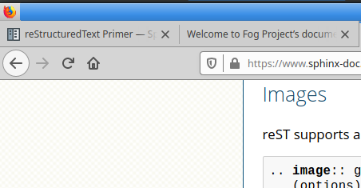

.. Fog Project documentation master file, created by
   sphinx-quickstart on Fri Oct  2 20:55:58 2020.
   You can adapt this file completely to your liking, but it should at least
   contain the root `toctree` directive.

Welcome to Fog Project's documentation!
=======================================

.. toctree::
   :maxdepth: 3
   :caption: Contents:

This is header one
==================

This is header two
------------------

This is header three?
^^^^^^^^^^^^^^^^^^^^^

Hi, this is a long list of text. Will the text automatically break down to the
next line of do I have to do that myself?

Is this a new paragraph?

- Item one
- Item two

Code example::

  jurgen@precious4:~/docstest/docs$ ls -lh
  totaal 76K
  drwxrwxr-x 4 jurgen jurgen 4,0K okt  4 10:22 _build
  -rw-rw-r-- 1 jurgen jurgen 5,1K okt  4 11:36 conf.py
  -rw-rw-r-- 1 jurgen jurgen  771 okt  4 14:03 index.rst
  -rw-rw-r-- 1 jurgen jurgen  814 okt  2 20:55 make.bat
  -rw-rw-r-- 1 jurgen jurgen  607 okt  2 20:55 Makefile
  -rw-rw-r-- 1 jurgen jurgen   17 okt  4 11:42 requirements.txt
  drwxrwxr-x 2 jurgen jurgen 4,0K okt  2 20:55 _static
  drwxrwxr-x 2 jurgen jurgen 4,0K okt  2 20:55 _templates

This results in this behaviour in firefox:

Indices and tables
==================

* :ref:`genindex`
* :ref:`modindex`
* :ref:`search`
